# 마케팅 데이터 분석
## Summary
채널 및 캠페인 유형별 성과를 평가하고, ROI에 영향을 미치는 핵심 요인을 파악하는것을 목표로 마케팅 캠페인 데이터를 분석했다

분석 결과 전체 캠페인의 평균 ROI는 5.50로 수익성을 확보하고 있었으나, 전체 캠페인의 38.9%는 손실(ROI < 0)을 기록하여 성과 편차가 크게 나타났다.

캠페인 유형별 ROI 차이는 크지 않았으며, 특정 캠페인 유형보다 전환율과 CPC(클릭당 비용)이 성과를 결정하는 주된 요인으로 확인되었다. 또한 고성과 캠페인은 낮은 CPC와 높은 전환율을 동시에 보유한 반면, 저성과 캠페인은 높은 CPC로 인해 수익성이 크게 저하되는 경향을 보였다.

## 1. Overview
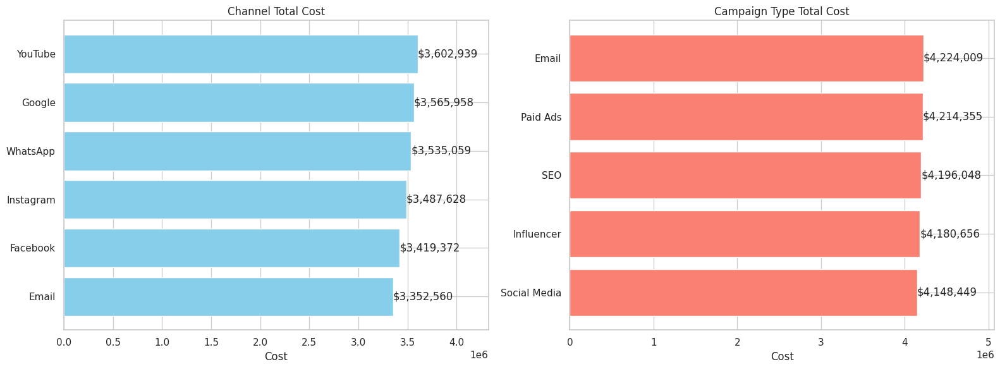

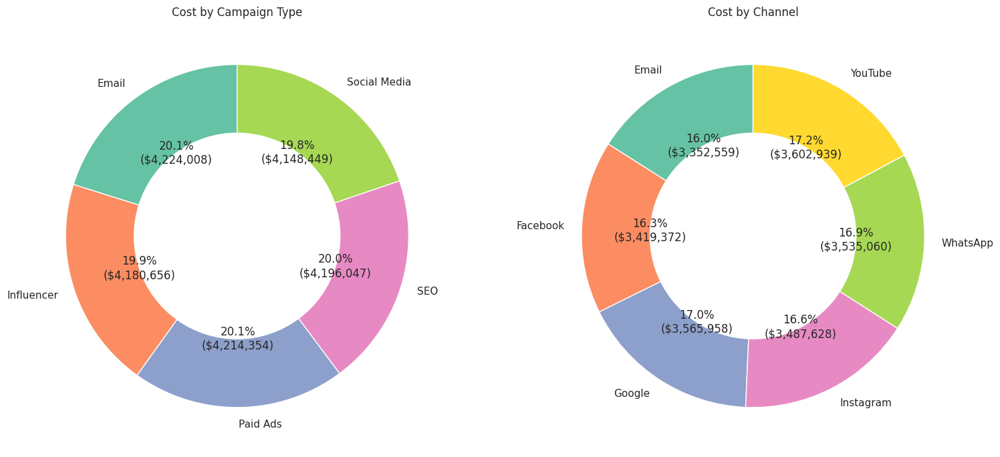

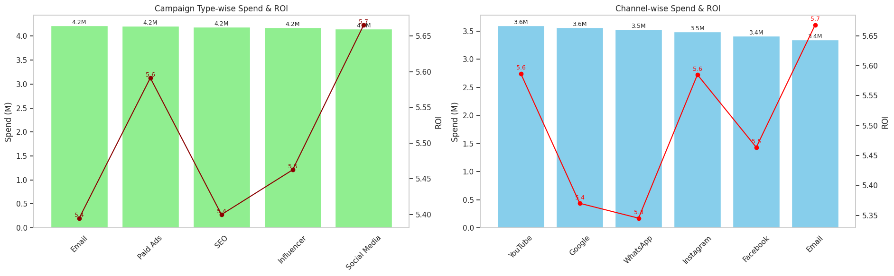

먼저 채널 및 캠페인 유형별 비용과 ROI를 비교하여 전체 마케팅 예산의 분배 구조와 성과 효율성을 분석하였습니다. 

모든 채널 및 캠페인 유형의 비용은 약 3.3M ~ 4.2M 수준으로 큰 편차 없이 집행되고 있으며, ROI 또한 약 5.3~5.7 범위 내에서 형성되어 있어 전반적으로 안정적인 성과 구조를 보이고 있습니다.

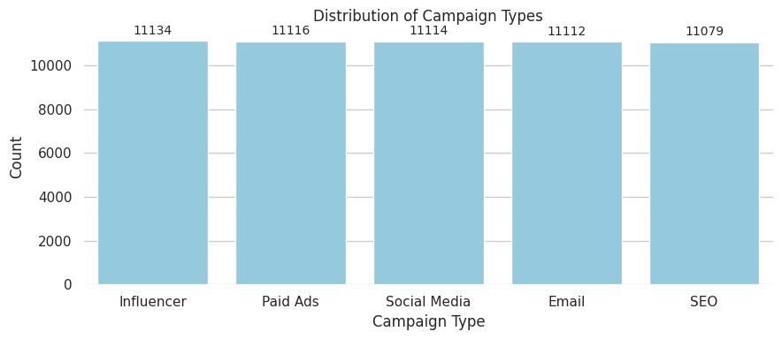

## 2. 수익 및 ROI 분포
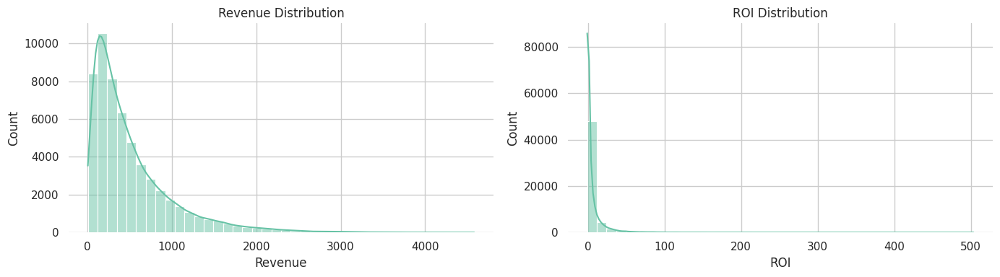

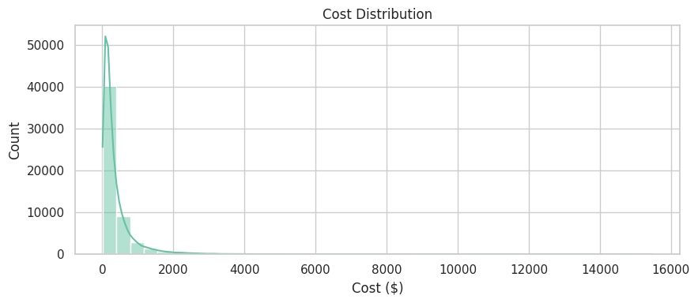

Revenue 분포는 우측으로 치우친 형태를 보였으며, 일부 고성과 캠페인이 전체 매출을 견인하는 구조가 나타났습니다.

ROI 역시 평균(5.50)이 중앙값(0.77)보다 크게 높아 성과가 일부 캠페인에 집중되어 있음을 확인할 수 있었습니다.

## 3. 성과 지표 분석
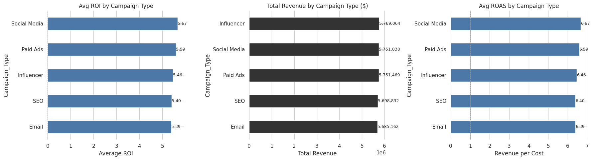

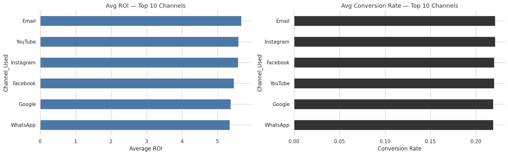
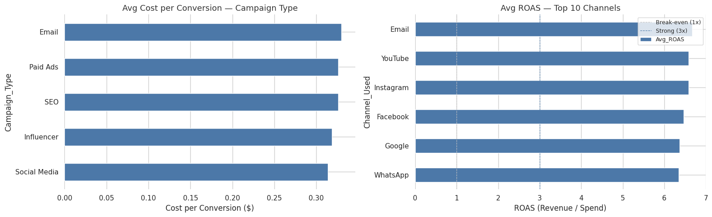

캠페인 유형과 채널별 성과를 비교한 결과, ROI·ROAS·전환율·CPC 모두 큰 차이를 보이지 않았습니다. 

다만 ROAS 분포가 평균(5.5) 대비 중앙값(1.77)이 낮고, 상위 일부 캠페인이 전체 평균을 끌어올리는 구조를 보였기 때문에 ROAS와 CPC 기준으로 두 그룹으로 분류해 분석하였습니다

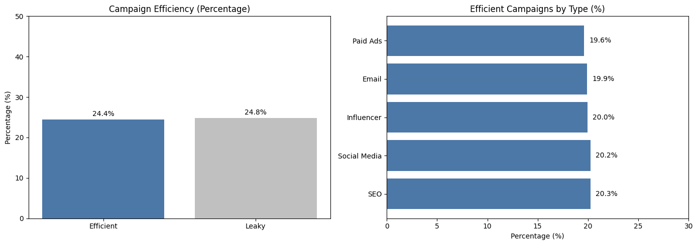

Efficient Campaigns (ROAS > 3 & CPC 하위 25%): 24.4%

Budget-leaking Campaigns (ROAS < 1 & CPC 상위 25%): 24.8%

두 그룹이 전체의 약 50%를 차지하고 있어, 캠페인 성과의 편차가 매우 큰 구조임을 확인할 수있었으며, Efficient 캠페인은 특정 캠페인 유형에 집중되지 않고 모든 유형에 고르게 분포되어 있었습니다

이를 통해 성과 차이는 캠페인 유형 자체보다는 개별 캠페인의 운영 효율성(타겟팅, 크리에이티브, 비용 구조 등)에 의해 발생할 가능성이 높음을 확인할 수 있습니다.

## 4. 퍼널
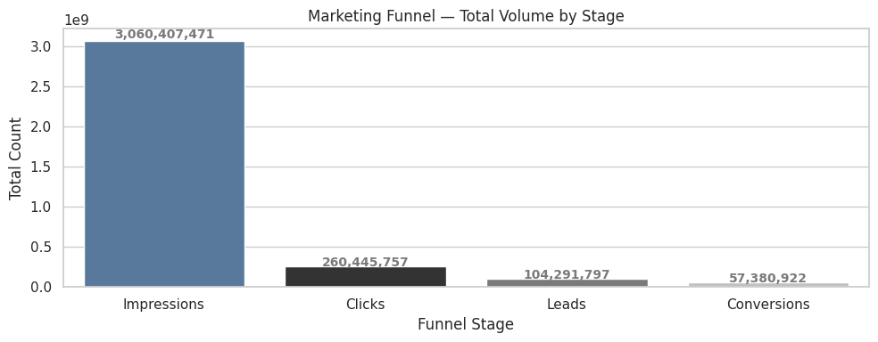

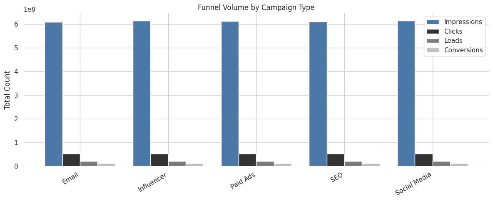

  Impressions → Clicks: 91.5% drop-off

  Clicks → Leads: 60.0% drop-off 

  Leads → Conversions: 45.0% drop-off 

  - Impressions → Clicks: 91.5% 이탈

  광고 노출은 충분하지만 광고 크리에이티브나 타겟팅 효율이 부족합니다

## 5.성과 대비 분석 
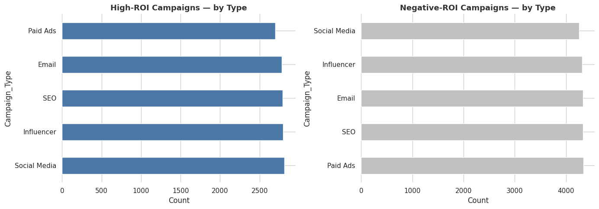
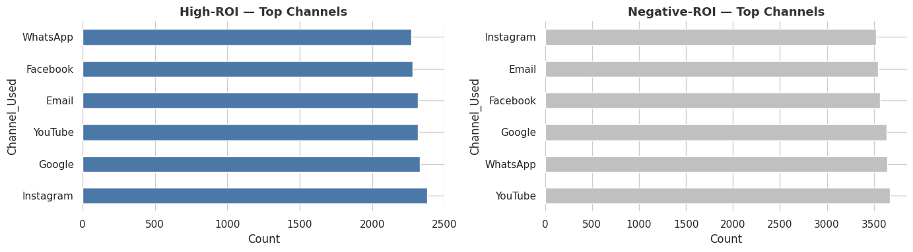

특히 고성과 캠페인과 저성과 캠페인의 세부 지표를 비교한 결과, 수익성 차이는 매우 뚜렷하게 나타났습니다.

고성과 캠페인은 ROAS 21.35배, CPC 0.011, Conversion Rate 0.275로 매우 높은 효율 구조를 보인 반면,
저성과 캠페인은 ROAS 0.36배, CPC 0.778, Conversion Rate 0.184로 비용 대비 낮은 성과를 기록하였으며 cpc, conversion rate와의 상관관계도 유의미하게 나왔습니다

이는 캠페인 수익성의 차이가 단순 매출 규모가 아니라, 클릭당 비용(CPC)과 전환 효율(Conversion Rate)의 구조적 차이에 의해 발생함을 시사합니다.

또한 고성과 및 저성과 캠페인의 채널 및 캠페인 유형 분포를 비교한 결과, 특정 채널이나 캠페인 유형에 편중된 패턴은 관찰되지 않았습니다.

## 6.결론

전체 캠페인 성과를 분석한 결과, 평균 ROI는 5.50으로 전반적으로 수익성을 확보하고 있었으나 약 38.9%의 캠페인은 ROI < 0을 기록하며 성과 편차가 크게 나타났다. 또한 ROAS 기준으로 약 61.6%의 캠페인만이 광고비를 회수하고 있어 일부 캠페인에 수익성이 집중되는 구조를 보였다.

추가 분석 결과 고성과와 저성과 캠페인 간 차이는 캠페인 유형이나 채널보다는 CPC와 전환율 구조에서 발생하는 것으로 나타났다. 특히 저성과 캠페인은 높은 CPC와 낮은 전환율이 동시에 나타나는 반면, 고성과 캠페인은 낮은 CPC와 높은 전환율이 결합된 형태를 보였다.

이러한 결과는 마케팅 성과가 채널이나 캠페인 유형이 아니라 전환 효율 구조(CPC 및 Conversion Rate)에 의해 결정된다는 점을 시사한다.

따라서 향후 마케팅 예산 최적화는 채널 또는 캠페인 유형 중심이 아니라, CPC, Conversion Rate, ROAS와 같은 성과 효율 지표 기반의 캠페인 단위 관리 체계로 전환할 필요가 있다.

